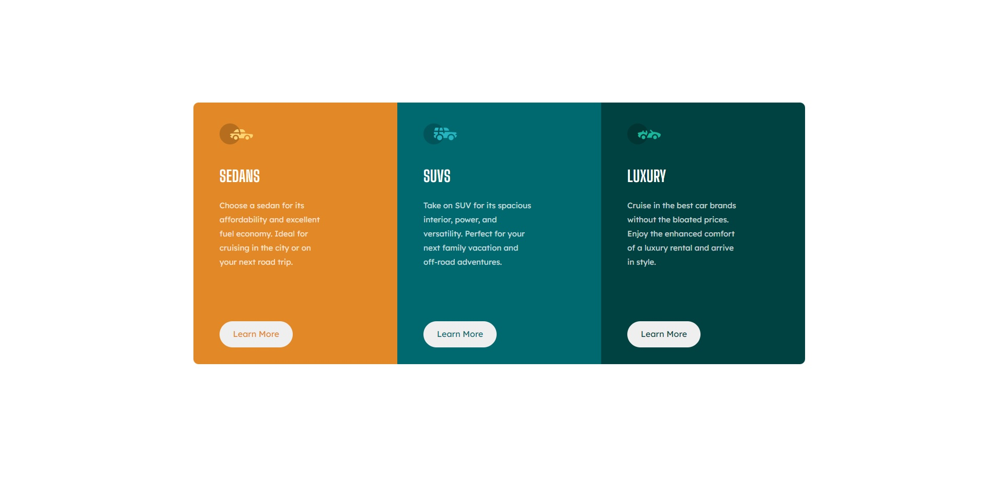

- Overview:
  - [3-Column Preview Card](#the-challenge)
  - [https://wella4life.github.io/Challenge_3_Easy/](#links)
  - 
  - 

 - Users should be able to:
   - View the optimal layout for the site depending on their device's screen size
   - Hover stats on "Learn More"

 - What I Learned:
   - Grid eases up the switch from Desktop to Mobile version
   - Margins change many things when you switch
   - Setting img to absolute, top to 0, and left to 0 then adjusting it is not always the best option
   - Setting the img alone helped when inside gridding to position everything on the same line
 
 - What I Couldn't Do:
   - Width was wider than the required by a lot
